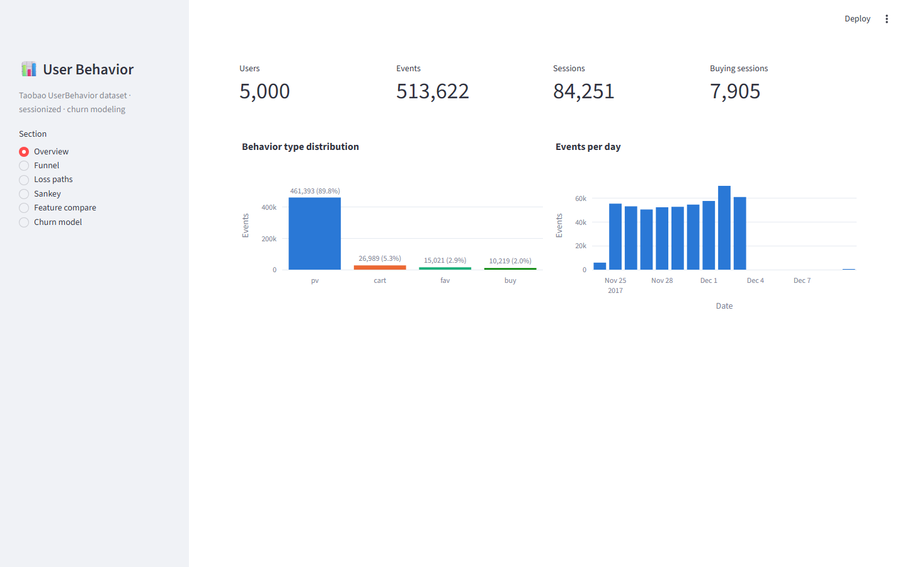
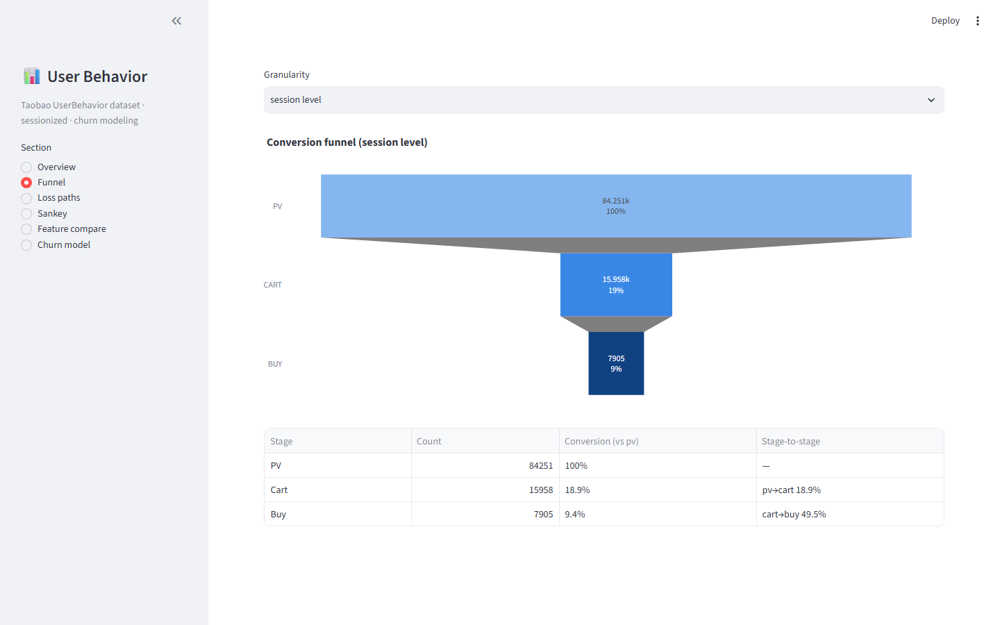
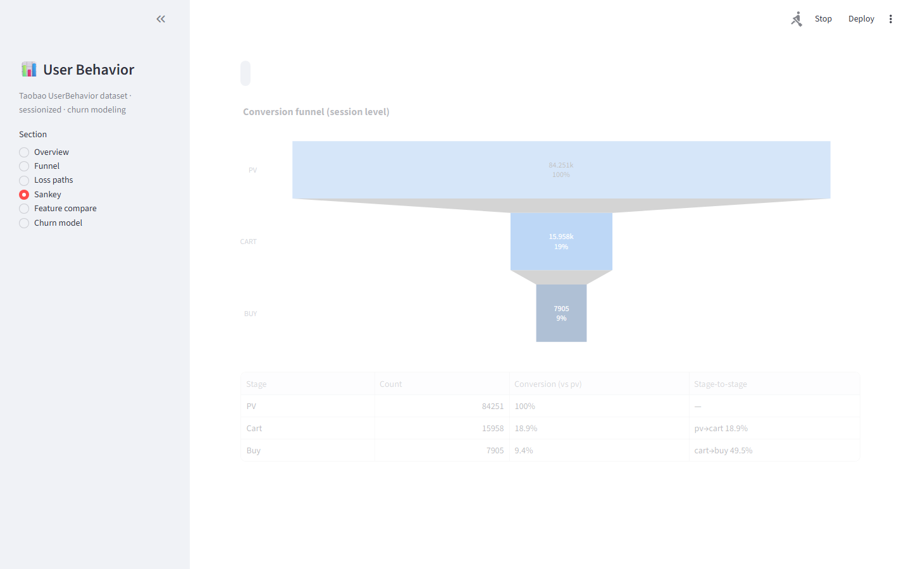
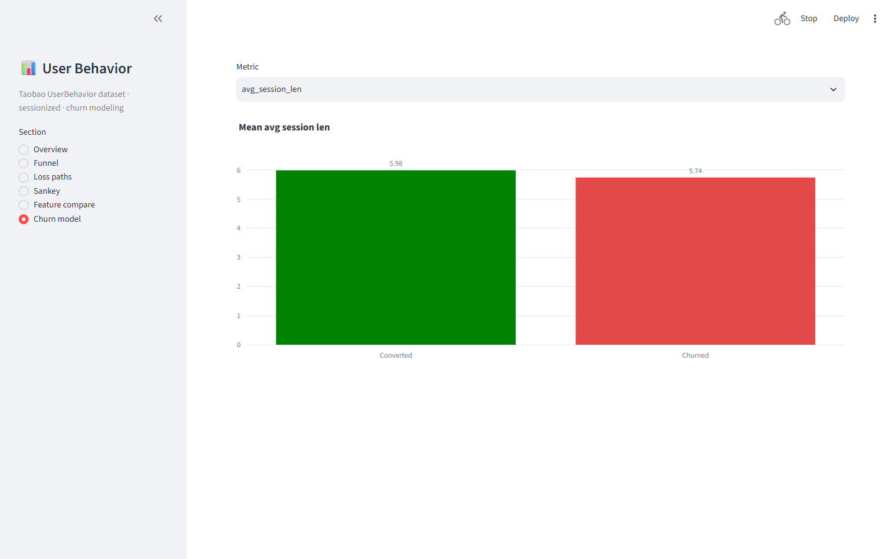

# E-commerce User Behavior Analysis

End-to-end analytics project on the **Taobao UserBehavior dataset** (~100M events,
1M users): a reproducible data pipeline that streams a **3.4 GB** raw dataset to
randomly sample **5,000 complete users**, sessionizes their behavior, analyzes the
conversion funnel and churn (loss) paths, trains **churn-prediction models** under
strict anti-leakage evaluation, and presents everything in an **interactive
Streamlit dashboard**.

> Earlier versions of the analysis scripts are archived in [`legacy/`](legacy/README.md)
> for reference.

<p align="center">
  
</p>

## Highlights

- **Streaming big-data ingestion** — two-pass chunked scan of the 3.4 GB CSV with
  ~100 MB peak memory; reproducible random sample of 5,000 complete users
  (`seed=42`)
- **Fully vectorized ETL** — 30-minute sessionization, behavior-sequence
  compression, and 20+ user-level features via `groupby` aggregations (no
  per-user Python loops)
- **Funnel & loss-path analysis** — conversion funnels at user and session level,
  three loss patterns (pure browse / cart abandonment / favorited-only), and a
  Sankey journey chart
- **Churn prediction with leak-safe evaluation** — Logistic Regression,
  RandomForest, and XGBoost under class imbalance, evaluated with **two split
  schemes** (random-by-user and strict time split: days 1–7 features → days
  8–10 label)
- **Interactive dashboard** — 6-section Streamlit app consuming only pipeline
  artifacts (never recomputes analysis)
- **Fully reproducible** — one-command pipeline (`python run_all.py`), pinned
  seed, unit-tested core logic

## Dataset

**Taobao UserBehavior** (Alibaba Tianchi): user behavior logs on a mobile
e-commerce platform, one record per interaction:

| Column | Type | Description |
|---|---|---|
| `user_id` | int | anonymized user id |
| `item_id` | int | anonymized item id |
| `category_id` | int | anonymized category id |
| `behavior_type` | str | `pv` (view) · `cart` (add to cart) · `fav` (favorite) · `buy` (purchase) |
| `timestamp` | int | unix timestamp |

The full dataset holds **~100M events** across **~1M users** over 10 days
(2017-11-24 → 2017-12-03). The pipeline samples **5,000 complete users**
(~500k events) so analysis stays interactive while remaining representative
(pv ≈ 89%, buy ≈ 2% — matching the public distribution).

> **Download:** the dataset is hosted on Alibaba Tianchi —
> [UserBehavior (淘宝用户购物行为数据集)](https://tianchi.aliyun.com/dataset/649)
> (free, requires a Tianchi account). Download `UserBehavior.csv`, unzip if
> needed, and place it at `data/raw/UserBehavior.csv` before running the
> pipeline (the file is gitignored, ~3.4 GB unpacked).

## Pipeline

```
data/raw/UserBehavior.csv  (3.4 GB, ~100M rows)
        │
        ▼ 01_sample_users.py   two-pass streaming sample: 5,000 complete users
data/processed/user_sample.parquet  (~500k events)
        │
        ▼ 02_build_features.py vectorized ETL
        ├─ events.parquet      events + session_id (30-min inactivity gap)
        ├─ sessions.parquet    compressed sequences, flags, durations
        └─ user_features.parquet 20+ features per user + bought label
        │
        ├─ ▼ 03_analysis.py    funnel · loss paths · sankey · feature compare
        │     └─ output/charts/*  output/metrics/*.json
        │
        └─ ▼ 04_churn_model.py  LR / RandomForest / XGBoost, group & time splits
              └─ output/model/*  + data/processed/model_predictions.parquet
        │
        ▼ dashboard/app.py     Streamlit — reads only the artifacts above
```

## Key Results

> Numbers below are produced by the current pipeline on the 5,000-user sample
> (re-run `python run_all.py` to regenerate).

### Conversion funnel (session level)

| Stage | Sessions | Conversion (vs pv) | Stage-to-stage |
|---|---|---|---|
| pv | 84,251 | 100% | — |
| cart | 15,958 | 18.9% | pv → cart: 18.9% |
| buy | 7,905 | 9.4% | cart → buy: 49.5% |

*User level: 69.2% of users buy; 92.6% of users who add to cart eventually buy.*

### Loss-path patterns (non-buying sessions, n = 76,346)

| Pattern | Sessions | Share |
|---|---|---|
| Pure page views (no interaction) | 55,851 | 73.2% |
| Cart abandoned | 14,271 | 18.7% |
| Favorited only | 6,224 | 8.2% |

### Churn prediction (random user split, test set)

| Model | ROC-AUC | PR-AUC | F1@0.5 | MCC | Precision@top-10% |
|---|---|---|---|---|---|
| Logistic Regression | 0.718 | 0.825 | 0.731 | 0.326 | 0.860 |
| RandomForest | 0.686 | 0.814 | 0.825 | 0.264 | 0.870 |
| XGBoost | 0.712 | 0.828 | 0.774 | 0.296 | 0.890 |

*Baseline prevalence (buyers in test set): 68.9%. Precision@top-10% = 0.89 means
that among the 10% of users the model is most confident about, 89% convert —
29% above the baseline.*

### Churn prediction (strict time split)

Features from days 1–7 predict the label from days 8–10 (no window overlap).
Prevalence in the label window: **38.6%**.

| Model | ROC-AUC | PR-AUC | Precision@top-10% |
|---|---|---|---|
| Logistic Regression | 0.571 | 0.466 | 0.570 |
| RandomForest | 0.530 | 0.409 | 0.440 |
| XGBoost | 0.526 | 0.417 | 0.460 |

Predicting a future window is harder — the top-decile precision still lifts 47%
over the 38.6% baseline. Run `python scripts/04_churn_model.py --split time`
to regenerate (the dashboard shows whichever split ran last).

## Dashboard screenshots

Run `streamlit run dashboard/app.py` for the full interactive app — every
chart below is live (hover, zoom, filter, and a threshold slider that
recomputes the confusion matrix).

<p align="center">
  
  
  
</p>

## Modeling details

- **Task**: predict whether a user purchases at all, from pre-purchase behavior.
- **Features** (21): event counts/rates (`cart_rate`, `fav_rate`), session
  structure (`n_sessions`, avg/median session length, session duration), activity
  (`n_active_days`, event cadence), diversity (`n_categories`, `n_items`,
  top-1 category share), and timing (evening share). The label is computed
  separately and an assertion blocks any buy-derived column from entering the
  feature matrix.
- **Imbalance**: only ~9% of users buy; handled with `class_weight` /
  `scale_pos_weight` and reported with **PR-AUC** (not just ROC-AUC) plus
  `precision@top-10%` vs the prevalence baseline.
- **Anti-leakage evaluation** (both provided):
  - `--split group`: stratified split by user — one row per user, so train and
    test never share a user.
  - `--split time`: features from **days 1–7**, label from **days 8–10**.
    Feature and label windows do not overlap, so the model cannot exploit
    post-decision information — a stronger claim than a random split.

## Directory structure

```
├── run_all.py                  one-command pipeline (01 → 04)
├── pyproject.toml              src-layout package (pip install -e .)
├── src/user_behavior_analysis/ shared logic: config, io, sessions,
│                                sequences, features, funnel, plots
├── scripts/                    01_sample_users · 02_build_features ·
│                               03_analysis · 04_churn_model
├── dashboard/app.py            Streamlit dashboard
├── docs/screenshots/           README screenshots (regenerate with
│                               scripts/screenshots.py)
├── tests/                      unit tests for sessionization, sequences,
│                               loss patterns, feature leak guard
├── data/                       [gitignored] raw + processed artifacts
├── output/                     [gitignored] charts, metrics JSON, model outputs
└── legacy/                     earlier analysis scripts (archived)
```

## Getting started

```bash
# 1. install
pip install -r requirements.txt
pip install -e .

# 2. place the dataset (gitignored)
#    <download UserBehavior.csv> -> data/raw/UserBehavior.csv

# 3. run the full pipeline
python run_all.py

# 4. run the dashboard
streamlit run dashboard/app.py

# 5. run the tests
python -m pytest
```

Optional: `python scripts/04_churn_model.py --split time` for the time-split
evaluation (the dashboard shows whichever split was run last).

## Reproducibility

- `SEED = 42` — sampling, train/test splits, and all models use the same seed.
- `SAMPLE_SIZE = 5000`, `SESSION_GAP_MINUTES = 30`, and the loss-pattern
  definitions live in `src/user_behavior_analysis/config.py`.
- Every pipeline step is idempotent; `python run_all.py` regenerates all
  artifacts from scratch.

## Tech stack

Python 3.11+ · pandas · numpy · matplotlib · plotly · scikit-learn · XGBoost ·
Streamlit · pytest

## License

MIT
